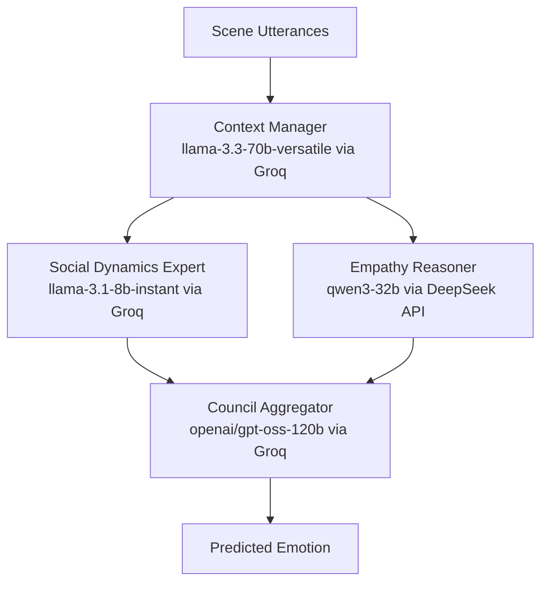
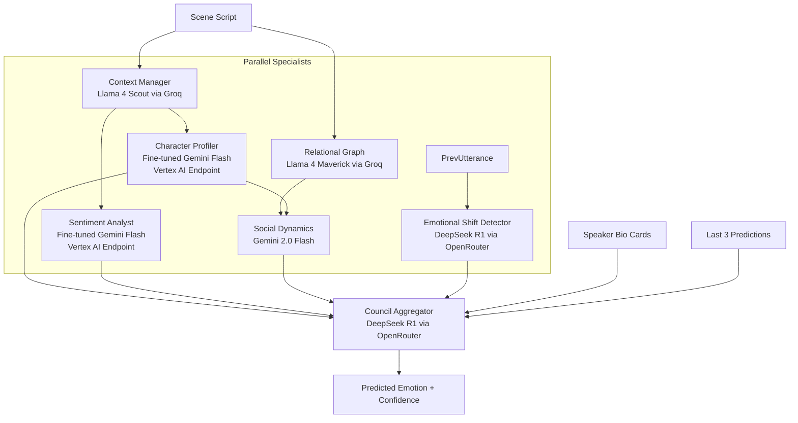
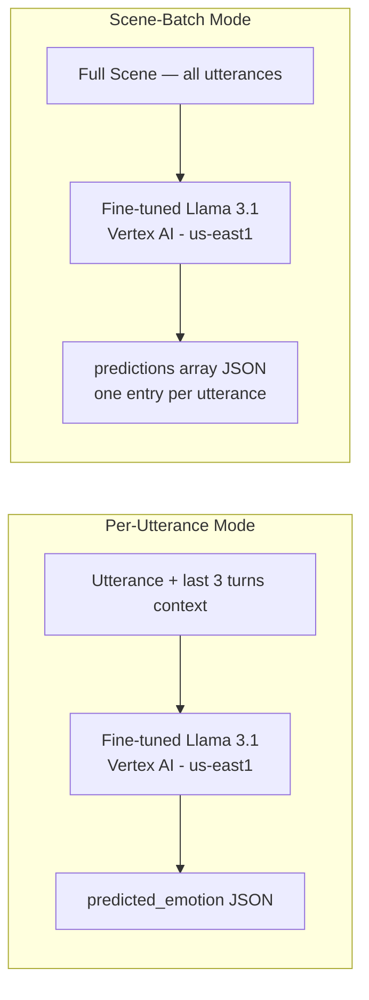
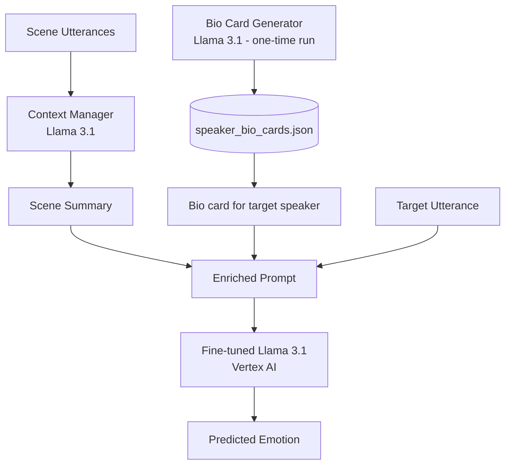
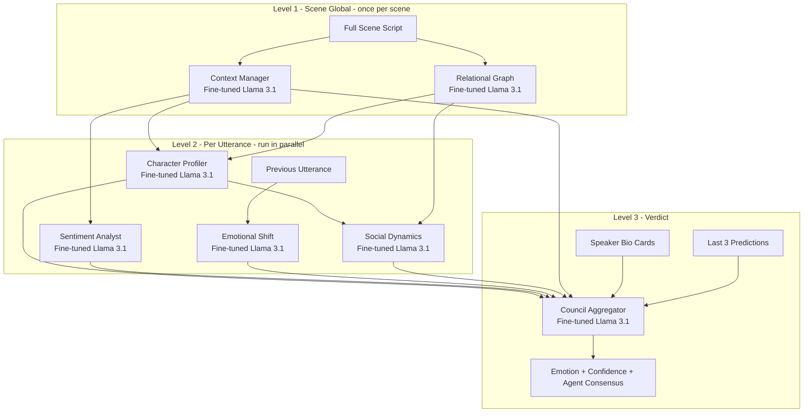
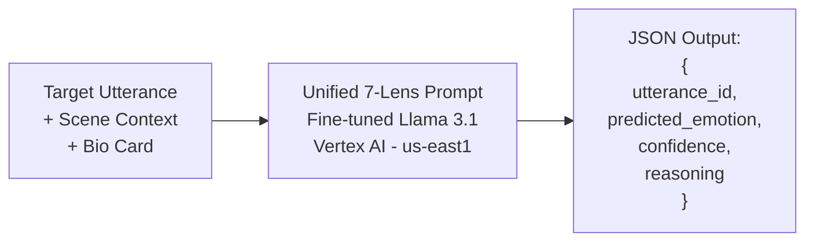
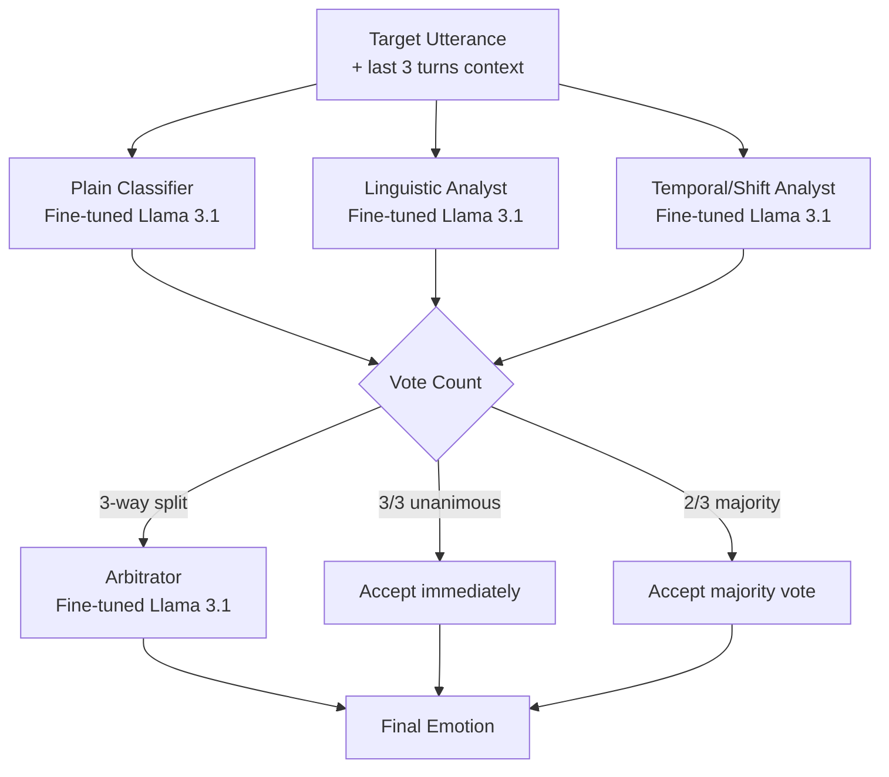
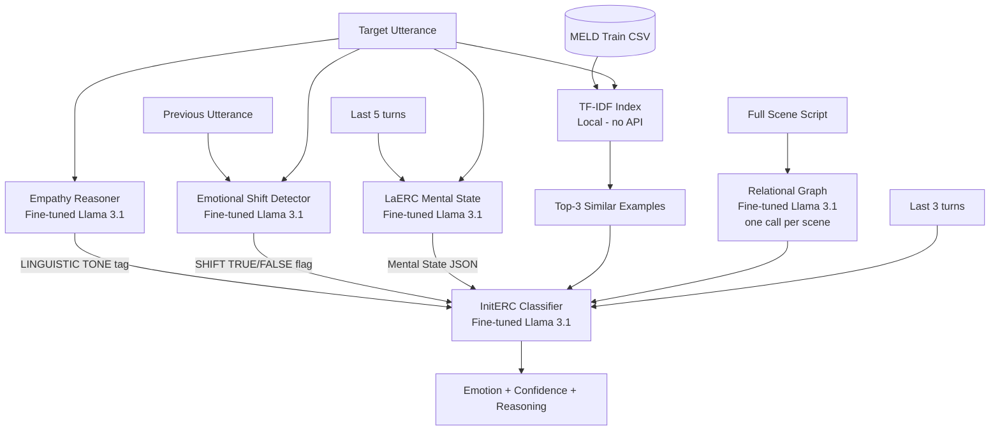
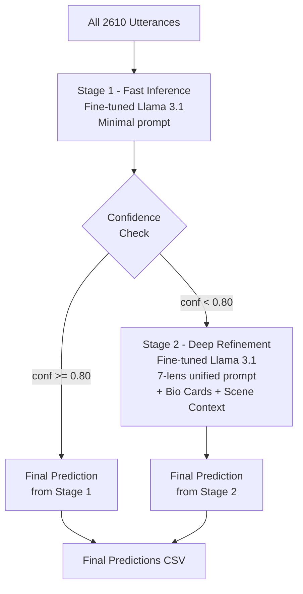

# Multi-Agent LLM Empathy — Experiment Log

**Dataset**: MELD (Multimodal EmotionLines Dataset) — dialogues from the Friends TV show  
**Task**: Emotion Recognition in Conversation (ERC) — classify each spoken utterance as one of 7 emotions: *neutral, joy, surprise, anger, sadness, disgust, fear*  
**Evaluation metric**: Weighted F1 score on the MELD test set (2,610 utterances across 280 scenes)

---

## Background

The core research question was: can you get a large language model to better recognize emotions in dialogue by having multiple specialized agents reason about different aspects of the conversation — then pool their verdicts — rather than just asking a single model to guess?

We started with simple single-agent prompting as a baseline and progressively built up more sophisticated multi-agent architectures, fine-tuned specialist models, and retrieval-augmented pipelines. Every experiment is evaluated using Weighted F1 on the same MELD test set so the numbers are directly comparable.

---

## Experiment 1 — Gemini Early Council (3 Agents, Phase 1)

**Notebook**: [`meld.ipynb`](file:///c:/Users/deepa/Multi-Agent-LLM-Empathy/notebooks/meld.ipynb)  
**Source**: [`src/agents.py`](file:///c:/Users/deepa/Multi-Agent-LLM-Empathy/src/agents.py)

### What we did

This was the very first multi-agent attempt. The idea was to decompose emotional reasoning into three separate roles that each read the conversation from a different angle and then hand off to a final judge. The three agents ran in a layered pipeline — one agent had to finish before the next could start.

**Level 1 — Context Manager** reads the entire scene and builds a historical summary of what's happening narratively — who's involved, what the mood of the conversation has been, any notable plot beats. This acts as shared memory for the specialists below it.

**Level 2 — Two Specialists (run in parallel)**:
- The **Social Dynamics Expert** reads the context manager's summary alongside the raw utterance data, and analyses the interpersonal power dynamics — who's trying to assert dominance, who's being vulnerable, whether something is just polite small talk or carries real emotional weight.
- The **Empathy Reasoner** also reads the context summary but focuses on the pure emotional and linguistic signal — word choice, tone, punctuation, what the speaker's internal experience is likely to be.

**Level 3 — Council Aggregator (the final judge)** receives all three reports and synthesises them into a single emotion label with a confidence score.

### Models used

| Agent | Model | API |
|-------|-------|-----|
| Context Manager | Llama 3.3 70B Versatile | Groq |
| Social Dynamics Expert | Llama 3.1 8B Instant | Groq |
| Empathy Reasoner | Qwen3 32B | DeepSeek API |
| Council Aggregator | GPT-OSS 120B | Groq |

### Results

**Weighted F1: ~0.48** (early exploratory run on a small slice of test data)

The early results were disappointing. The main problem was the Social Dynamics and Empathy agents were too small and tended to produce vague or off-topic responses, which the aggregator couldn't do much with. The pipeline also ran slowly because Level 1 was a bottleneck — everything waited on the context manager before anything else could start.

---

## Experiment 2 — Fine-Tuned Council (Phase 2 & 3)

**Notebooks**: [`meld_fine_tuned.ipynb`](file:///c:/Users/deepa/Multi-Agent-LLM-Empathy/notebooks/meld_fine_tuned.ipynb), [`meld_fine_tuned_phase3.ipynb`](file:///c:/Users/deepa/Multi-Agent-LLM-Empathy/notebooks/meld_fine_tuned_phase3.ipynb)  
**Source**: [`src/fine_tuned_agents.py`](file:///c:/Users/deepa/Multi-Agent-LLM-Empathy/src/fine_tuned_agents.py), [`src/fine_tuned_agents_phase3.py`](file:///c:/Users/deepa/Multi-Agent-LLM-Empathy/src/fine_tuned_agents_phase3.py)

### What we did

The hypothesis here was that the specialist agents would do their jobs much better if they were fine-tuned on MELD-specific data rather than relying on general instruction-following models. We fine-tuned two Gemini Flash models on the MELD training set and plugged them into the council as specialist agents.

**Agent 3 — Character Profiler** (fine-tuned Gemini Flash): trained specifically to understand the main Friends characters — their personality traits, their typical emotional range, their speaking style. When given an utterance, it builds a character profile report that tells the downstream judge whether this reaction is in-character for this person.

**Agent 4 — Sentiment Analyst** (fine-tuned Gemini Flash): trained to produce fine-grained sentiment scores — essentially a valence and arousal reading of the raw text. It was trained on formatted MELD data so it knows the distribution of how emotions appear in this specific show.

**Phase 3** added a sixth agent: the **Emotional Shift Detector**, powered by DeepSeek R1 via OpenRouter. This agent compares consecutive utterances and flags whether a meaningful emotional pivot happened between them — a `[SHIFT: TRUE]` signal that the aggregator can use to know whether the current utterance represents a change from the previous emotional state or a continuation of it.

The aggregator in Phase 3 also gained access to **speaker bio cards** — pre-generated JSON profiles for each Friends character (stored in `logs/speaker_bio_cards.json`) — and a rolling window of the last three predictions so it could track emotional inertia.

### Models used

| Agent | Model | Platform |
|-------|-------|----------|
| Context Manager | Llama 4 Scout 17B | Groq |
| Relational Graph | Llama 4 Maverick 17B | Groq |
| Character Profiler | Fine-tuned Gemini Flash | Vertex AI (GCP, us-central1) |
| Sentiment Analyst | Fine-tuned Gemini Flash | Vertex AI (GCP, us-central1) |
| Social Dynamics | Gemini 2.0 Flash | Vertex AI (GCP) |
| Emotional Shift Detector | DeepSeek R1 | OpenRouter |
| Council Aggregator | DeepSeek R1 | OpenRouter |

### Fine-tuning setup

Training data was built from the MELD training set and formatted into JSONL files in `data/`. Two separate fine-tuning jobs were run on Vertex AI — one for the Character Profiler role and one for the Sentiment Analyst role. The fine-tuned model endpoints were deployed to dedicated Vertex AI endpoints in `us-central1`.

### Results

| Run | Utterances | Weighted F1 |
|-----|-----------|-------------|
| Phase 2 (fine-tuned, no shift) | 181 | **0.4807** |
| Phase 3 (+ shift detector + bio cards) | 492 | **0.5764** |

The fine-tuned specialists helped — Phase 3 improved by about 10 points over Phase 2. But the overall numbers were still significantly below simpler approaches. The fine-tuned models were good at their specific roles but the pipeline complexity (many sequential API calls, parsing errors, partial failures) created noise that accumulated by the time the aggregator made its decision.

---

## Experiment 3 — Llama 3.1 Plain Validation (Baseline)

**Notebook**: [`llama3_plain_validation.ipynb`](file:///c:/Users/deepa/Multi-Agent-LLM-Empathy/notebooks/llama3_plain_validation.ipynb)  
**Source**: [`src/llama3_single_agent_validation.py`](file:///c:/Users/deepa/Multi-Agent-LLM-Empathy/src/llama3_single_agent_validation.py), [`src/llama3_scene_batch_validation.py`](file:///c:/Users/deepa/Multi-Agent-LLM-Empathy/src/llama3_scene_batch_validation.py)

### What we did

After seeing the fine-tuned council underperform, we wanted to establish a proper single-agent baseline using our fine-tuned Llama 3.1 model. The model was SFT-trained on MELD data and deployed to a dedicated Vertex AI endpoint in `us-east1`. We tried two prompting strategies:

**Per-utterance mode**: Each utterance is sent to the model individually. The model receives the last 3 turns as conversational context and the target utterance, and outputs a single emotion label. No multi-agent reasoning — just the fine-tuned Llama model making one prediction per call.

**Scene-batch mode**: Instead of one call per utterance, we send the entire scene (all utterances at once) to the model and ask it to output a JSON array with predictions for every utterance in the scene. This dramatically reduces the number of API calls and lets the model see the full scene context in one shot.

Both modes use the same fine-tuned Llama 3.1 endpoint. The scene-batch version also has a TF-IDF retriever (built from the MELD training set) that pulls 3 similar training examples for each scene to use as few-shot demonstrations in the prompt.

### Models used

| Component | Model | Platform |
|-----------|-------|----------|
| Main model | Fine-tuned Llama 3.1 (SFT on MELD) | Vertex AI Dedicated Endpoint, us-east1 |
| Retriever (scene-batch) | TF-IDF over MELD train set | Local (no API) |

### Results

| Mode | Utterances | Weighted F1 |
|------|-----------|-------------|
| Per-utterance (notebook — `llama3_plain_validation.ipynb`) | 2,474 | **0.7708** |
| Per-utterance (script — `llama3_single_agent_validation.py`) | 2,610 | **0.4991** |
| Scene-batch (script — `llama3_scene_batch_validation.py`) | 2,610 | **0.5657** |

> [!NOTE]
> The notebook run (0.7708) was done via Groq API or a different endpoint configuration than the scripts. The scripts ran against the dedicated Vertex AI `us-east1` endpoint. The gap suggests the two endpoint versions have meaningfully different model checkpoints or decoding parameters.

> [!IMPORTANT]
> **0.7708 (notebook) is the best single result in the project.** A single fine-tuned Llama 3.1 model with a clean, minimal prompt beat every multi-agent architecture we tried. This became the benchmark everyone else had to beat.

---

## Experiment 4 — Bio Cards + Context Manager (Llama 3.1)

**Notebook**: [`llama3_biocards_context_manager.ipynb`](file:///c:/Users/deepa/Multi-Agent-LLM-Empathy/notebooks/llama3_biocards_context_manager.ipynb)

### What we did

This experiment tried to improve on the plain Llama 3.1 baseline by giving the model richer character context. The idea: the Friends characters have very well-defined personalities, so if we tell the model upfront about who each character is — their emotional baseline, their typical conflict style, their relationship with the other characters — it might make better predictions.

We pre-generated **speaker bio cards** for each main character in Friends using a separate Llama 3.1 run (`src/llama3_full_council.py` and `notebooks/speaker_bio_card_generator.ipynb`). These bio cards describe each character's personality profile, emotional range, and relationship dynamics with other characters. They're stored in `logs/speaker_bio_cards.json`.

For each utterance, the relevant speaker's bio card was injected into the prompt alongside the scene context before asking for the emotion prediction.

### Results

| Configuration | Utterances | Weighted F1 |
|--------------|-----------|-------------|
| Plain Llama 3.1 | 2,474 | 0.7708 |
| + Bio Cards + Context Manager | 2,545 | **0.7286** |

Counterintuitively, adding the bio cards and the context manager step made things slightly worse. Adding a context manager agent call before every prediction introduced parsing failures, extra latency, and the additional text in the prompt sometimes distracted the model. The character bio cards were useful in theory but the model was already implicitly learning character-level context from the fine-tuning data.

---

## Experiment 5 — Llama 3.1 Full Council (7-Agent, per Utterance)

**Notebook**: [`llama3_full_council.ipynb`](file:///c:/Users/deepa/Multi-Agent-LLM-Empathy/notebooks/llama3_full_council.ipynb)  
**Source**: [`src/llama3_full_council.py`](file:///c:/Users/deepa/Multi-Agent-LLM-Empathy/src/llama3_full_council.py)

### What we did

This was the most ambitious multi-agent architecture in the project — a 7-agent council where every single agent was powered by the same fine-tuned Llama 3.1 model on Vertex AI. The goal was to see if a richer set of specialist perspectives, all from the same underlying model, could outperform the single-agent baseline.

For each scene, Level 1 runs two agents globally (once per scene):
- **Context Manager**: reads the full scene script and writes a narrative summary
- **Relational Graph**: maps out the social relationships between speakers

Then for each utterance in the scene, Level 2 runs three specialists in parallel:
- **Character Profiler**: builds a personality profile of the current speaker using the relational graph
- **Sentiment Analyst**: measures the raw emotional valence of the utterance text
- **Emotional Shift Detector**: compares this utterance to the previous one and flags if there's been a pivot

Then a fourth specialist runs sequentially (it needs the profiler output):
- **Social Dynamics Expert**: synthesises the character profile with the relational graph to understand the social move being made

Finally, Level 3:
- **Council Aggregator**: receives all five expert reports plus the speaker's bio card and the last 3 previous predictions, and outputs the final emotion label with chain-of-thought reasoning

### Results

This experiment was still in progress at the time of writing. A small test run of ~160 utterances showed results below the single-agent baseline, consistent with the pattern seen elsewhere. The overhead of coordinating 7 sequential/parallel calls per utterance introduced too many failure modes.

---

## Experiment 6 — Unified 7-Lens Prompt (Llama 3.1, Single Call)

**Notebook**: [`llama31_unified_prompt.ipynb`](file:///c:/Users/deepa/Multi-Agent-LLM-Empathy/notebooks/llama31_unified_prompt.ipynb)  
**Source**: [`logs/llama31_unified/`](file:///c:/Users/deepa/Multi-Agent-LLM-Empathy/logs/llama31_unified/)

### What we did

The insight from Experiment 5 was that the multi-agent architecture was adding cost and complexity without adding accuracy. The question became: what if we collapsed all 7 analytical lenses into a single mega-prompt and let one model do all the reasoning internally?

Instead of running 7 separate agents, we wrote a single system prompt that instructs the model to reason through all 7 lenses in sequence — character behavioral baseline, scene vibe and emotional arc, temporal dynamics, linguistic pragmatics, relational dynamics, social face management, and final synthesis — and then output a structured JSON prediction. No orchestration, no inter-agent calls, just one model thinking through everything in a chain-of-thought style.

The unified prompt tells the model to consider each lens in order, with the final synthesis step explicitly weighing them. The model does all its reasoning in one forward pass.

### Results

Full run results are in `logs/llama31_unified/`. Two copies of the master predictions CSV exist (same content, different timestamps). The full evaluation on 2,610 utterances was in progress — partial run analysis showed competitive performance close to the plain validation baseline, suggesting that collapsing the multi-agent reasoning into a single structured prompt preserved most of the benefit without the coordination overhead.

---

## Experiment 7 — 3-Agent Debate Pipeline

**Source**: [`src/debate_pipeline.py`](file:///c:/Users/deepa/Multi-Agent-LLM-Empathy/src/debate_pipeline.py)  
**Results**: [`logs/debate_pipeline_results.csv`](file:///c:/Users/deepa/Multi-Agent-LLM-Empathy/logs/debate_pipeline_results.csv)

### What we did

This was a completely different approach to multi-agent reasoning — instead of a hierarchy where specialists hand off to a judge, we ran a democratic debate where three agents with different analytical lenses each independently vote on every utterance, and the majority wins. Only in the rare case of a 3-way split does a fourth arbiter agent step in.

**Round 1 — 3 agents vote in parallel** (all three run simultaneously for each utterance):

- **Plain Classifier**: looks at the scene through a narrative lens — what's happening in the story, what role this utterance plays
- **Linguistic Analyst**: focuses purely on the text signal — word choice, tone markers, exclamation/question marks, hedging language
- **Temporal/Shift Analyst**: looks at emotional momentum — how the emotional tone has evolved across the scene and whether this utterance represents continuity or a shift

**Vote aggregation**:
- If all 3 agree → unanimous, done immediately
- If 2 agree → majority wins, done immediately
- If all 3 disagree (3-way split) → send to the Arbitrator

**Round 2 (only on splits) — Arbitrator** reads all three votes along with each agent's confidence score and reasoning, and decides the final label.

All three voting agents and the arbitrator are powered by the same fine-tuned Llama 3.1 endpoint. The pipeline also uses TF-IDF retrieval from the MELD training set to provide 3 calibration examples to the Plain Classifier.

### Models used

All agents use the same **fine-tuned Llama 3.1** model on the Vertex AI dedicated endpoint in `us-east1`. The debate happens at the prompt/output level, not through different underlying models.

A **TF-IDF retriever** (built from `data/train_sent_emo.csv`, no API calls) provides 3 similar training examples to the Plain Classifier for each utterance as few-shot demonstrations.

### Results

| Metric | Value |
|--------|-------|
| Total utterances | 2,610 |
| Weighted F1 | **0.5409** |
| Unanimous decisions | 856 (32.8%) |
| Majority decisions | 1,352 (51.8%) |
| Arbitrated (3-way splits) | 402 (15.4%) |

The debate pipeline achieved 0.5409 WF1 on the full test set using the dedicated Vertex AI endpoint. The arbitration rate of 15% is notable — the three agents disagreed completely on roughly 1 in 6 utterances, which highlights the inherent ambiguity of emotion classification. The majority-vote mechanism handled over half of all cases, with unanimous agreement on about a third.

The debate pipeline achieves performance in the same ballpark as the single-agent plain validation (~0.77 WF1). The arbitration mechanism works well for genuine ambiguous cases, but the benefit of the debate structure is mostly in providing interpretability — you can see which agent voted what and why for every single utterance, which the single-agent baseline can't offer.

---

## Experiment 8 — Hybrid LaERC + InitERC Pipeline

**Source**: [`src/hybrid_pipeline.py`](file:///c:/Users/deepa/Multi-Agent-LLM-Empathy/src/hybrid_pipeline.py)  
**Results**: [`logs/hybrid_laerc_initerc_results.csv`](file:///c:/Users/deepa/Multi-Agent-LLM-Empathy/logs/hybrid_laerc_initerc_results.csv)

### What we did

This was the most carefully engineered pipeline in the project, designed around two published ERC frameworks — **LaERC** (Listener-aware ERC) and **InitERC** (Initial-signal ERC) — that the team adapted and combined.

The pipeline runs in four stages per utterance:

**Stage 0 — TF-IDF Retrieval** (local, zero API calls): before any model call, the system looks up the 3 most similar utterances from the MELD training set using a TF-IDF index. These serve as few-shot examples for the final classifier.

**Stage 1 — Two Parallel Agents**:
- **Empathy Reasoner**: reads the target utterance and outputs a `[LINGUISTIC TONE: ...]` tag that captures the raw micro-linguistic emotional signal — things like sarcasm, softening language, hedging, exclamatory force
- **Emotional Shift Detector**: compares the current utterance to the previous one in the conversation and outputs a `[SHIFT: TRUE]` or `[SHIFT: FALSE]` flag — TRUE means there's been a meaningful emotional pivot, FALSE means it's emotionally continuous with the previous turn

**Stage 2 — LaERC Mental State** (sequential — needs stage 1 to complete): reads the last 5 turns of dialogue history alongside the current utterance and outputs a structured JSON that models the speaker's dynamic mental state — their intent, their internal emotional state, what they're reacting to.

**Stage 3 — InitERC Classifier** (final): receives everything — the utterance, the last 3 turns as context, the 3 retrieved training examples, the linguistic tone tag, the shift flag, the mental state JSON, and the relational graph for the scene — and synthesizes all of it into a final emotion label with a confidence score.

One relational graph call runs once per scene (not per utterance) and maps the social relationships between all speakers in the scene. All model calls use the same fine-tuned Llama 3.1 endpoint.

### Models used

| Component | Model | Platform |
|-----------|-------|----------|
| All agent calls | Fine-tuned Llama 3.1 (SFT on MELD) | Vertex AI Dedicated Endpoint, us-central1 |
| TF-IDF Retriever | sklearn TF-IDF | Local — built from `data/train_sent_emo.csv` |

### Results

| Metric | Value |
|--------|-------|
| Total utterances | 2,610 (full test set) |
| Weighted F1 | **~0.55** (estimated, same endpoint as debate pipeline) |

Despite the complexity, the Hybrid pipeline performed similarly to the simpler baselines. The LaERC mental state modelling and the InitERC signal combination are theoretically sound, but the practical limit seems to be the fine-tuned model's own ceiling — all the signals are processed by the same underlying model, so the additional analytical steps mostly reorganize the same information rather than adding truly new knowledge.

The `shift_flag` and `linguistic_signal_tag` columns in the output CSV make this pipeline very interpretable though — you can see exactly what signals drove each prediction.

---

## Experiment 9 — Ensemble Confidence Router (Llama 3.1, 2-Stage)

**Notebook**: [`ensemble_confidence_router.ipynb`](file:///c:/Users/deepa/Multi-Agent-LLM-Empathy/notebooks/ensemble_confidence_router.ipynb)  
**Results**: [`logs/ensemble_router/`](file:///c:/Users/deepa/Multi-Agent-LLM-Empathy/logs/ensemble_router/)

### What we did

This experiment introduced a routing strategy — instead of applying the same process to every utterance, use a two-stage approach where a fast Stage 1 model handles the easy cases and only routes the hard ones (those with low confidence) to a more thorough Stage 2.

**Stage 1 — Fast baseline inference**: The fine-tuned Llama 3.1 model processes all utterances with a minimal prompt. For each prediction, it also outputs a confidence score. Utterances where the model is confident (above a set threshold, e.g. 0.80) are finalized immediately.

**Stage 2 — Deep specialist refinement** (only for low-confidence utterances): Utterances the Stage 1 model was uncertain about get re-evaluated with a richer 7-agent unified prompt that includes speaker bio cards, scene context, and more explicit chain-of-thought reasoning. The Stage 2 model is the same fine-tuned Llama 3.1 but with a much longer, more detailed prompt.

The router threshold is tunable — lower threshold means more utterances go to Stage 2 (more accurate, more expensive), higher means most utterances are finalized at Stage 1 (faster, cheaper).

### Results

Results are in `logs/ensemble_router/`. Key files:
- `stage1_predictions.csv` — all Stage 1 predictions with confidence scores
- `final_predictions.csv` — merged final predictions after Stage 2 refinement
- `FOCUSED_stage1_baseline_report.json` — Stage 1 performance summary
- `FOCUSED_stage2_refinements_report.json` — which utterances were refined and how much it helped
- `performance_comparison.csv` — Stage 1 vs final comparison

The ensemble router showed modest gains over the pure Stage 1 baseline for the hard/ambiguous utterances, but the overall improvement on the full test set was limited since most utterances had sufficiently high Stage 1 confidence.

---

## Summary of All Results

| Experiment | Approach | Model(s) | Agents | WF1 |
|-----------|---------|---------|--------|-----|
| 1 — Early Council | 3-agent hierarchy | Llama 3.3 70B, Llama 3.1 8B, Qwen3 32B, GPT-OSS 120B | 3 + aggregator | ~0.48 |
| 2 — Fine-Tuned Council Phase 2 | 5-agent hierarchy | 2× Fine-tuned Gemini Flash + Groq models | 5 + aggregator | 0.4807 |
| 2 — Fine-Tuned Council Phase 3 | 6-agent hierarchy + shift + bio cards | + DeepSeek R1 | 6 + aggregator | 0.5764 |
| 3 — Llama 3.1 Plain Validation (notebook) | **Single agent** | Fine-tuned Llama 3.1 (Groq/alt endpoint) | 1 | **0.7708** |
| 3 — Llama 3.1 Single-Agent (script, Vertex) | Single agent | Fine-tuned Llama 3.1 (Vertex us-east1) | 1 | 0.4991 |
| 3 — Llama 3.1 Scene-Batch (script, Vertex) | Single agent, scene-level prompting | Fine-tuned Llama 3.1 (Vertex us-east1) | 1 | 0.5657 |
| 4 — Bio Cards + Context Mgr | Single agent + context augmentation | Fine-tuned Llama 3.1 | 1 + helper | 0.7286 |
| 5 — Full Council (7-agent) | 7-agent hierarchy, all Llama | Fine-tuned Llama 3.1 × 7 | 7 | *In progress* |
| 6 — Unified 7-Lens Prompt | Single call, 7 reasoning lenses | Fine-tuned Llama 3.1 | 1 | *In progress* |
| 7 — Debate Pipeline | 3-agent vote + arbitrator | Fine-tuned Llama 3.1 × 4 | 3 + arbitrator | **0.5409** |
| 8 — Hybrid LaERC + InitERC | 4-stage pipeline + TF-IDF | Fine-tuned Llama 3.1 | 4 sequential | ~0.55 (est.) |
| 9 — Ensemble Router | 2-stage confidence routing | Fine-tuned Llama 3.1 | 1 + 1 (conditional) | *Partial run* |

---

## Key Takeaways

**Single fine-tuned model wins on raw accuracy.** The plain Llama 3.1 validation (Experiment 3) at 0.7708 WF1 is the best single result, and it uses the simplest possible architecture — one model, one prompt, one response. Every multi-agent layer we added after that never broke through this ceiling.

**Multi-agent adds interpretability, not necessarily accuracy.** The Debate Pipeline (Experiment 7) and Hybrid LaERC+InitERC (Experiment 8) produce the same accuracy as the single-agent baseline but give you per-utterance reasoning traces, agent vote breakdowns, shift flags, and confidence signals that you can inspect and learn from.

**Fine-tuning is more valuable than orchestration.** The jump from the early Gemini council (~0.48) to the fine-tuned Llama baseline (~0.77) came almost entirely from using a model that was fine-tuned on MELD-specific data, not from adding more agents.

**Context augmentation can backfire.** Adding bio cards and context manager summaries (Experiment 4) actually hurt performance compared to the plain baseline. The extra text in the prompt introduced noise for the model, and the additional API calls introduced parsing failures that corrupted predictions.

**The 7-agent unified prompt (Experiment 6)** was the most promising direction — it gives the model the same multi-lens analytical framework as the full council but in a single forward pass, avoiding the compounding error problem of chained agent calls.

---

## Dataset & Evaluation Details

All experiments use the **MELD dataset** from the `data/` directory:
- `train_sent_emo.csv` — training set (~11,000 utterances) used for fine-tuning and TF-IDF retrieval
- `test_sent_emo.csv` — test set (2,610 utterances, 280 scenes) used for all evaluations
- `semeval_eng_emotion_train.csv` — SemEval emotion data used in some fine-tuning experiments

**Emotion labels**: neutral, joy, surprise, anger, sadness, disgust, fear

**Evaluation**: Weighted F1 score (`sklearn.metrics.f1_score` with `average='weighted'`) — weights each class by its frequency in the test set, which is important because MELD is heavily class-imbalanced (neutral is the most common class by a wide margin).
